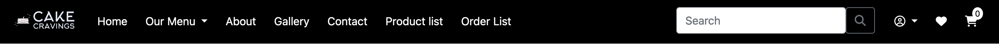
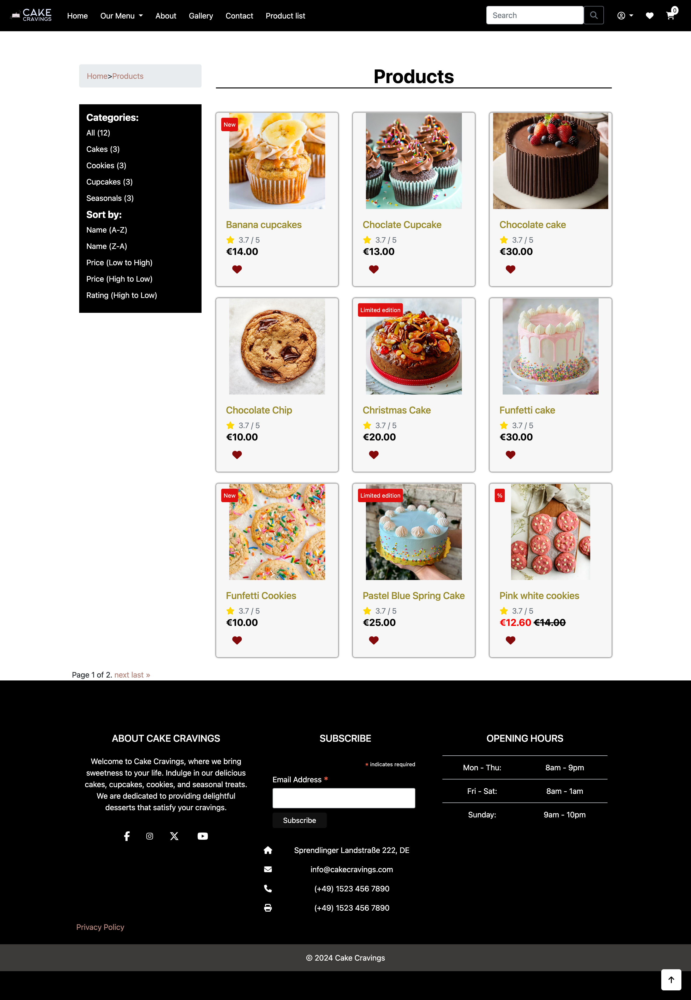
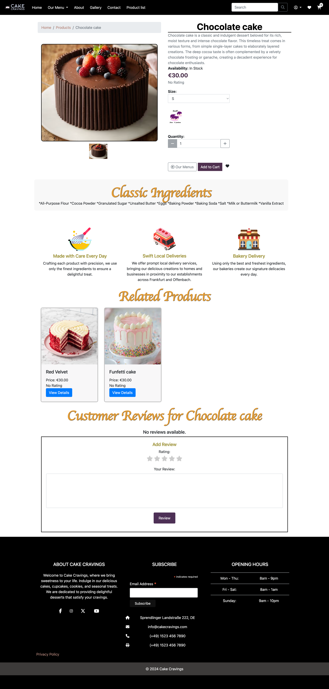
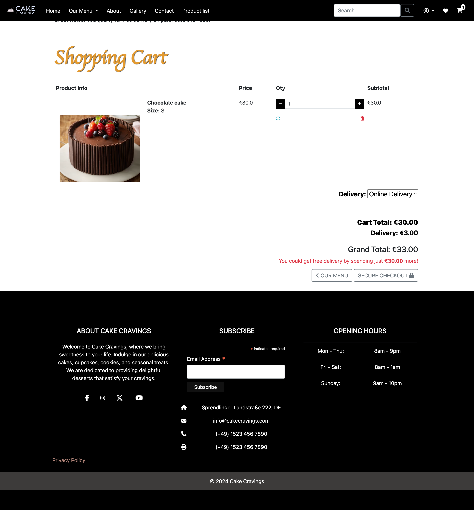
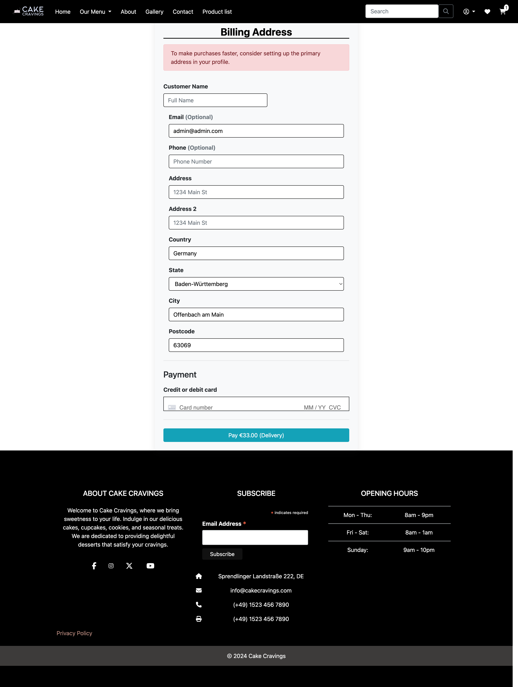
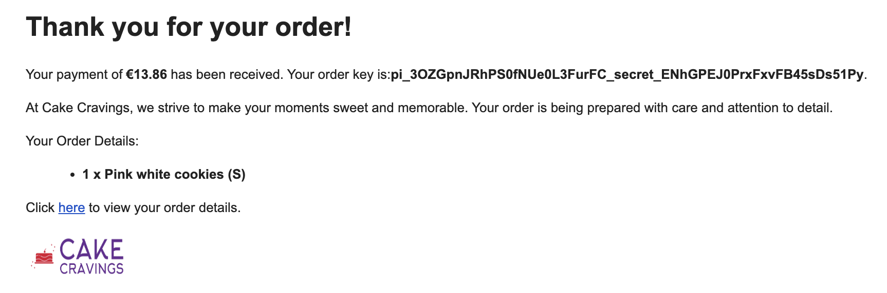
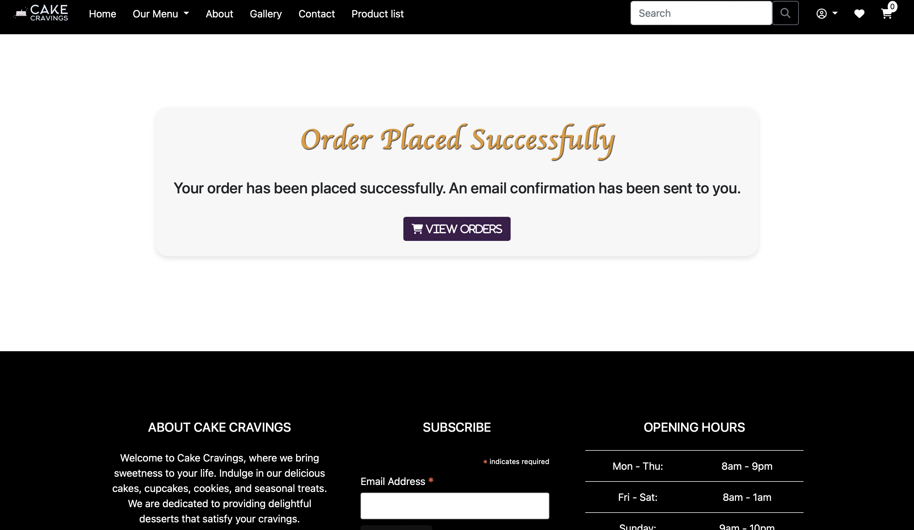
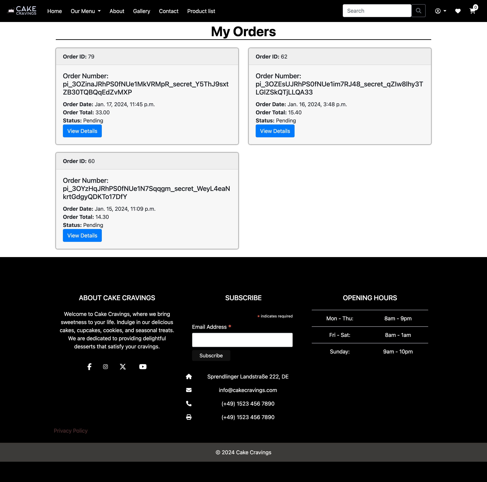
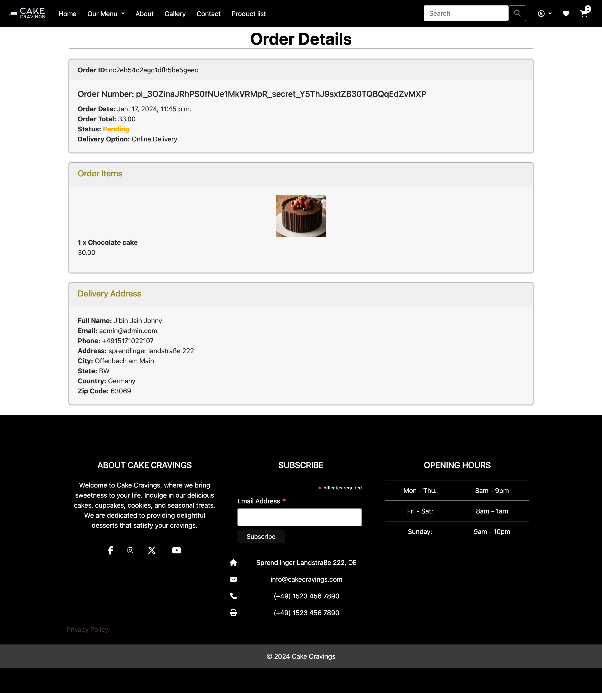
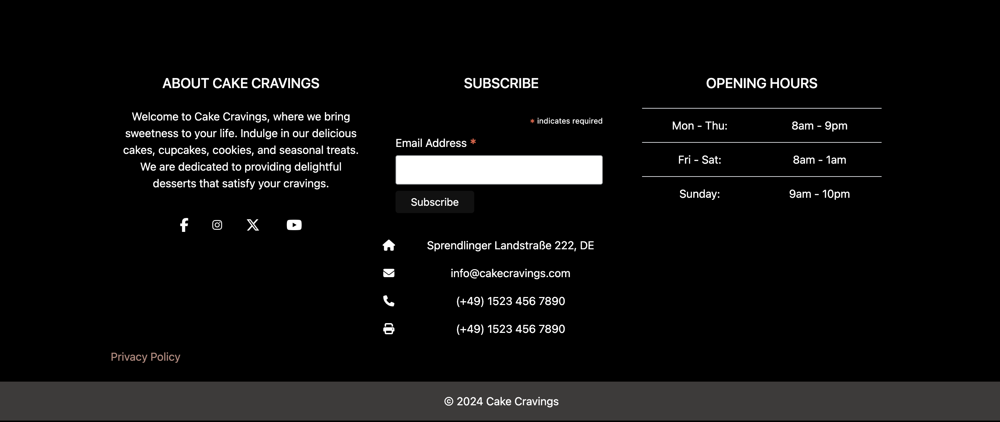

# Features

## Access to pages according to the user role:

| Page Name | Logged out  | Customers  | Manager | Admin |
| --------- | ----------- | ---------- | ------- | ----- |
| Home       | Yes         | Yes        | Yes     | Yes   |
| Login      | Yes         | Yes        | Yes     | Yes   |
| Register   | Yes         | Yes        | Yes     | Yes   |
| Logout     | Yes         | Yes        | Yes     | Yes   |
| Products   | Yes         | Yes        | Yes     | Yes   |
| Product's Details | Yes         | Yes        | Yes     | Yes   |
| All reviews   | Yes         | Yes        | Yes     | Yes   |
| Cart       | No         | Yes        | Yes     | Yes   |
| Profile   | No         | Yes        | Yes     | Yes   |
| Edit profile   | No        | Yes        | Yes     | Yes   |
| Add address   | No         | Yes        | Yes     | Yes   |
| All addresses   | No         | Yes        | Yes     | Yes   |
| Edit address   | No         | Yes        | Yes     | Yes   |
| My Orders   | No         | Yes        | Yes     | Yes   |
| My Order's Details   | No         | Yes        | Yes     | Yes   |
| My Wishlist   | No         | Yes        | Yes     | Yes   |
| My reviews   | No         | Yes        | Yes     | Yes   |
| Checkout   | No         | Yes        | Yes     | Yes   |
| Products add | No         | No         | Yes     | Yes   |
| Products Update | No         | No         | Yes     | Yes   |
| Products delete | No         | No         | Yes     | Yes   |
| Adding Tag | No         | No         | Yes     | Yes   |
| Tags | No         | No         | Yes     | Yes   |
| Add tag | No         | No         | Yes     | Yes   |
| Edit tag | No         | No         | Yes     | Yes   |
| Delete tag | No         | No         | Yes     | Yes   |

## Main Features:

- All page has a navbar and a footer

### Navbar:
1. If the user is authenticated, the Navbar includes the following features:

    - logo, which redirects to the home page;
    - Our Menu, dropdown menu contains:
        + All products,if click all products redirect to all products in product page
        + Cakes,if click cakes redirect to category cake products in product page
        + Cupcakes,if click cup cakes redirect to category cupcake products in product page
        + Cookies,if click cookies redirect to category cookies products in product page
        + Seasonals,if click Seasonal redirect to Seasonal category products in product page.
    - About ,if click about link it will redirect to about section in home page.
    - Gallery,if click gallery link it will redirect to gallery section in home page.
    - Contact,if click contact link it will redirect to contact section in home page.
    - Product list link it is only use for manager and admin customers have no access this link ,if click products list link it will redirect to product list page managers or admin can add update and delete products and add and change and delete tags also there.
    - Search bar ,if write the product name or category name can easily search using search bar.
    - user icon, if click that icon it is a dropdown menu it contains
        + Profile,if click profile it will redirect to profile page in profile page we can add user details .
            * in profile page there is another three buttons like address,accountsettings and  account delete
            * if click address redirect to address page there any one can see the address also user can update address.
            * account setting, if click account setting button redirect to reset email and rest password button there user can update username and password.
            * account delete, if user click account delete user can delete there account
            * order button,if click order button redirect to order page .
            * logout button,if click logout button redirect to logout page from there user can easily logout then it will redirect to login page.
    - wishlist heart icon, if click icon redirect to wishlist button there any products in wishlist we can delete from there.
    - cart icon,if any products in the cart cart count will show in cart icon.if click cart icon it will redirect to cart page .
        + In cart page we can see the carted product.In cart page we can update quantity 
        + delete product from cart
        + Select delivery option  online or pickup.
        + our menu button if click it will redirect to product page.
        + click secure checkout button it will redirect to payment page.

### Home page:
   
   - Hero section,it contains a order now button it will redirect to product page
   - About section,it contains writings and image about cake cravings bakery.
   - Gallery section ,it contains image gallery if we click images it helps to see the image big using modal.
   - contact section,it contains address and location map.

### Product page:

- In products page we can see product list each products have there on cards if we click on each product card it will redirect to product detail page.
- wishlist button in products card,if click heart button product will added to wishlist page.
- breadcrumbs ,if click the breadscrumb link it will redirect to corresponding page and product.
- in left side we can select products based on category.if we click category we can see cooresponding products.
- sorting products based on name (a to z)  and (z to a) 
- sorting products based on price (low to high) and (hight to low)
- sorting products based on rating (high to low)
- page pagination we can redirect to next page also come back to last page option.
- page up arrow we can easily redirect to page top with help for up arrow.

### Product Detail page:

- Product detail page we can select size the product have size.
- based on size product price will change also image for product size also change based on size.
- product with out price not showing size selecting option.
- User can Update quantity .quantity less than 1 will be disable (only quantity select from 1 to 99 )
- there is two buttons one for our menu it will redirect to products page
- add to cart button it will redirect to cart page.
- in top leftbreadcrumbs we user can see the path of pages also user can easily navigate to corresponding pages.
- main image part and thumbnails user can change the image using thumbnail image it can see in main image section.
- Ingredients ,user can know about main ingredients use for the product.
- three marketing image with discription mouse over effect is given.
- Related product section,user can easily know about related products from there if click that related product card it will redirect to corresponding product detail page.
- In the review section, users are limited to submitting only one review for each specific product.

### Cart Page

- In cart page we can see the carted product.In cart page we can update quantity 
- delete product from cart
- Select delivery option  online or pickup.
- our menu button if click it will redirect to product page.
- more than 60 euro purchase have no delivery cost and delivery option pickup have also no delivery cost.
- if user select delivery option online delivery cost will added in delivery part also grand total update.
- click secure checkout button it will redirect to payment page.
- In cart there is no product user can see button for redirect to product page.

### Payment Page

- In payment page if the user set primary address it will come here .
- if not set primary address user can easily add there delivery address and eaily pay the amount using strip payment system. 
- payment page there is a pay button in pay button user can see payment amount and delivery option they select in cart page.
- If the payment successfull user will get confirmation email. 

- then redirect to user order confirmation page

### Order confirmation page

- After payment user will redirect to this page here we can click order button it will redirect to user order page.

### User Order Page

- user can see there orders each order cards have order detail button if click that button it will redirect to order detail page.

- here user can see all information about order.

### Footer

- contains short discription of cake cravings
- social media links facebook,instagram,twitter,youtube.Each icons redirect to corresponding social media page.
- subscription email id section users can subscribe by writing emai id and click subscribe button. 
- next users can see address,email id,phone number and fax
- next opening hours of the shop users can visit the shop during that time.