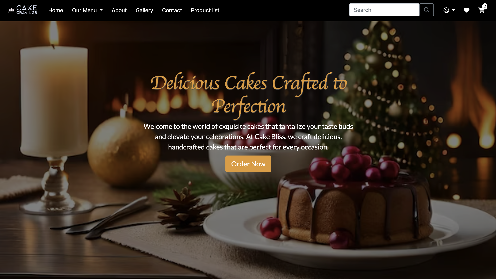

### Cake Cravings E-commerce website
Indulge in the Sweet World of Cake Cravings – Your Ultimate Dessert Destination! 🎂

**Deployed website: [Link to website]()**



**Card number for payment testing: 4242424242424242**
## About

Cake Cravings is not just a website; it's a celebration of flavors and sweetness. Dive into a world of delicious cakes and treats curated just for you.

### Key Features
User-Friendly Experience: Navigate our platform effortlessly for a delightful shopping journey.

#### Secure Login System:
 Your security is our priority. Enjoy a safe and protected login system.

#### Product Management for Admins: 
Admins have the power to curate and manage our delightful collection of products, ensuring a fresh and diverse offering for our customers.

#### Effortless Checkout: 
Experience a smooth and stress-free checkout process for a swift and satisfying shopping experience.

#### Secure Payment System:
Trust our secure payment system for worry-free transactions.

### Notification System: 
Never miss out! Receive notifications when your favorite products are back in stock by submitting a request.

#### Admin Superpowers:
Product Curation: As an admin, take charge of the product catalog. Add, update, or remove products to keep our offerings as delightful as ever.

#### Why Cake Cravings?
Cake Cravings is not just a website; it's an experience crafted with love and passion. Whether you're a dessert enthusiast or someone with a sweet tooth, Cake Cravings welcomes you to a world of sugary delights.

Embark on this delightful journey with Cake Cravings – where every slice tells a story!

---
## UX
### User-Focused Design
#### Eye-Catching Interface:

Our website boasts an appealing and engaging design, capturing the essence of our delectable treats and creating a visually pleasing experience.
Plentiful Choices:

Users are presented with a diverse array of mouthwatering options, ensuring a delightful shopping experience with a variety of choices to suit every taste.
Effortless Navigation
Intuitive User Experience:

The emphasis is on a user-friendly journey, allowing users to effortlessly navigate the website and achieve their goals with ease.

#### Easy Shopping:

Designed for simplicity, our website ensures that users can easily find, select, and purchase their favorite treats without unnecessary complexities.
Streamlined Functionality
Limited Roles for Simplicity:

Cake Cravings keeps it simple with only two roles: Super User and User, ensuring a straightforward experience for all users.
#### Efficient Backend Management:

The platform efficiently handles all backend functionalities, seamlessly transitioning from super user responsibilities to user interactions.
Scalability and Reusability
#### Scalable Architecture:

Our business goals prioritize scalability, making Cake Cravings adaptable to future growth and evolving requirements.


## Target Audience

This platform is tailored for individuals who appreciate the convenience of online shopping, specifically for indulging in delectable baked goods and delightful treats. The target audience includes:

#### Cake Enthusiasts:

Individuals with a sweet tooth, seeking a diverse range of cakes and cupcakes,cookies and seasonals for various occasions.
#### Busy Professionals:

Those with hectic schedules looking for a hassle-free way to order delicious treats online.
#### Celebration Planners:

Event organizers or individuals planning celebrations, who want to conveniently order customized cakes and desserts.
#### Gift Shoppers:

People searching for the perfect sweet gift, personalized for birthdays, anniversaries, or special moments.
#### Online Shoppers:

Anyone who enjoys the ease of online shopping and desires a seamless experience when purchasing bakery items.
Features Tailored for You
#### Discount Seekers:

Cake Cravings offers competitive pricing and occasional discounts to make your sweet indulgence even more delightful.
#### No-Fuss Notification System:

Stay informed about new arrivals, promotions, and product availability with our user-friendly notification system.
#### Easy Navigation:

The website is designed to be user-friendly, ensuring a smooth and straightforward experience for users of all levels of tech-savviness.
Whether you're a cake connoisseur, a busy professional, an event planner, or someone simply craving a delightful treat, Cake Cravings is here to cater to your sweet desires with a click of a button!


## Web Marketing
Embark on a delightful journey through the enticing universe of Cake Cravings! Elevate your sweet tooth experience by connecting with us through our carefully curated newsletters, where we share exclusive updates, tempting offers, and mouthwatering insights. Dive deeper into the confectionery magic on our vibrant Facebook page, where the community comes together to celebrate the art of baking, exchange delightful recipes, and revel in the joy of all things sweet. For a visual feast and behind-the-scenes sneak peeks, follow us on Instagram, where every post is a visual ode to the exquisite world of Cake Cravings. Join our thriving online community and indulge in the sweetness that transcends the ordinary – because at Cake Cravings, every interaction is a celebration of flavor, creativity, and the pure joy of savoring life's sweet moments!


## Future Development:

Cake Cravings is committed to constant innovation to elevate your experience, and we're thrilled to share some exciting future developments:

#### Mobile App Launch:

We're in the process of crafting a dedicated Cake Cravings mobile app. Soon, you'll have the convenience of exploring our delectable offerings, placing orders, and engaging with our community right from your mobile device. Stay tuned for a seamless, on-the-go experience.
#### Collaborations and Partnerships:

We're actively seeking collaborations with renowned pastry chefs, artisanal bakers, and other brands to bring you exclusive and limited-edition offerings. Brace yourself for unique, collaborative creations that will add an extra layer of sweetness to your Cake Cravings experience.
#### Vendor Section:

Introducing a dedicated vendor section, where local bakers and confectionery artists can showcase their talent. This section aims to create a diverse marketplace, offering a variety of sweet delights from different vendors. If you're a talented baker, get ready to join our community and share your creations with the world.
#### German Language Option:

Cake Cravings is going global, and part of this expansion includes introducing a German language option. We want to ensure that our German-speaking community can fully immerse themselves in the world of Cake Cravings, exploring, and ordering with ease.
#### Enhanced Sales Analytics for Admin:

Admins will soon have a comprehensive view of the platform's performance. We're enhancing the admin dashboard to include detailed sales analytics, allowing administrators to understand total sales, best-selling products, and customer trends. This data-driven approach will empower admins to make informed decisions and further optimize the Cake Cravings experience.
#### Expanded Categories and Products:

Get ready for an even wider array of choices! We're expanding our categories and product offerings to cater to every sweet craving imaginable. From new flavors to unique confections, Cake Cravings will continue to be your go-to destination for a diverse and delightful selection of treats.

## Technologies used
- ### Languages:
    + [Python 3.9.13](https://www.python.org/downloads/release/python-3913/): the main language utilized to create the website's server side.
    + [JS](https://www.javascript.com/): the main language utilized to create the website's interactive elements.
    + [HTML](https://developer.mozilla.org/en-US/docs/Web/HTML): the markup language that was utilized to make the webpage.
    + [CSS](https://developer.mozilla.org/en-US/docs/Web/css): the language of styling that was applied to the website.

- ### Frameworks and libraries:
    + [Django](https://www.djangoproject.com/): This entire logic was created using a Python framework.
    + [jQuery](https://jquery.com/): was employed to send AJAX requests and manage click events.

- ### Databases:

    + [SQLite](https://www.sqlite.org/): served as a database for development.
    + [PostgreSQL](https://www.postgresql.org/): the database that contained all of the data.
    

- ### Other tools:

    + [Git](https://git-scm.com/): the version control system used to manage the code.
    + [Pip3](https://pypi.org/project/pip/): the dependencies were installed using the package manager.
    + [Gunicorn](https://gunicorn.org/): the webserver used to run the website.
    + [Spycopg2](https://www.python.org/dev/peps/pep-0249/): the database driver that established the database connection.
    + [Django-allauth](https://django-allauth.readthedocs.io/en/latest/): the authentication library used to create the user accounts.
    + [Django-crispy-forms](https://django-cryptography.readthedocs.io/en/latest/): was used to control the rendering behavior of Django forms.
    + [Render](https://render.com/): the cloud computing system that houses the website.
    + [ElephantSQL](https://www.elephantsql.com/): the cloud database used to store all the data.
    + [GitHub](https://github.com/): used to store the source code for the website.
    + [VSCode](https://code.visualstudio.com/): the IDE used to develop the website.
    + [Chrome DevTools](https://developer.chrome.com/docs/devtools/open/): was used to debug the website.
    + [Font Awesome](https://fontawesome.com/): was used in the creation of the website's icons.
    + [W3C Validator](https://validator.w3.org/): was used to validate HTML5 code for the website.
    + [W3C CSS validator](https://jigsaw.w3.org/css-validator/): was used to validate CSS code for the website.
    + [JShint](https://jshint.com/): was used to validate JS code for the website.
    + [PEP8](https://pep8.org/): was used to validate Python code for the website.
    + [birme.net](https://www.birme.net/): was used to crop and center unsplash images.
    + [stripe](https://stripe.com/): was used to create the payment system.
    + [Privacy Policy Generator](https://www.privacypolicygenerator.info/) was used to create the privacy policy.

## Features


Please refer to the [FEATURES.md](FEATURES.md) file for all test-related documentation.


## Design Overview:

At Cake Cravings, our design philosophy revolves around creating a visually appealing, user-friendly, and delightful experience for every visitor. We believe that the aesthetics of our platform should reflect the sweetness of the treats we offer. Here's an overview of our design principles:

#### Whimsical Palette:

Our color palette is carefully chosen to evoke a sense of whimsy and joy. Soft pastels combined with rich, indulgent tones create a visual atmosphere that mirrors the diverse and delightful world of desserts.

  
#### Typography Overview:

In crafting the visual identity of Cake Cravings, we've carefully selected fonts to enhance the overall aesthetic and readability of our platform.

1. 'Lato', sans-serif:

For another set of elements, we've opted for the 'Lato' font. Lato is a versatile sans-serif typeface chosen for its clean lines and modern appeal. It ensures readability and a contemporary look across different devices and browsers.


2. "Great Vibes", cursive:

This font brings a touch of elegance and handcrafted charm to specific elements on our website. If your device supports "Great Vibes," you'll experience a decorative and personalized feel. Otherwise, the browser will gracefully fall back to a generic cursive font for a consistent look.

#### Intuitive Navigation:

Navigating through Cake Cravings is as smooth as buttercream frosting. We prioritize an intuitive and user-friendly interface, ensuring that visitors can easily explore our extensive range of treats, recipes, and community features without any hassle.
#### Mouthwatering Imagery:

Every image on Cake Cravings is carefully selected to tantalize taste buds. High-resolution, delectable visuals showcase the intricate details of our treats, leaving visitors craving for more. Whether it's a sumptuous cake slice or a perfectly crafted pastry, our imagery aims to capture the essence of indulgence.
#### Responsive Layout:

Cake Cravings is designed to be accessible from any device. Our responsive layout ensures a seamless and consistent experience, whether you're browsing on a desktop, tablet, or smartphone. The design adapts dynamically to different screen sizes, maintaining its charm across the board.
#### Engaging Community Spaces:

The design extends beyond product pages to create vibrant community spaces. Engaging visuals and interactive elements foster a sense of community, encouraging users to share their baking experiences, discover new recipes, and connect with fellow dessert enthusiasts.
#### Clear Call-to-Actions:

We understand that simplicity is key. Clear and enticing call-to-action buttons guide users through the platform, whether it's placing an order, joining a community discussion, or exploring our latest collaborations. Our design encourages seamless interaction, ensuring users can effortlessly navigate through their Cake Cravings journey.
#### Consistent Branding:

Consistency is the heartbeat of our design. From the website to newsletters and social media, we maintain a cohesive visual identity that reflects the warmth, creativity, and joy inherent in the Cake Cravings brand.
#### Imagery
- Images were downloaded from the websites listed in the **Credits section**. [Content and Images](#content-and-images)
- At Cake Cravings, we've elevated our user experience with a distinctive approach to icons sourced from the [font awesome](https://fontawesome.com/) library. Icons play a pivotal role in guiding users through multifunctional aspects of our website. Embracing innovation, we've carefully selected and customized these icons to provide a unique and visually engaging experience. 


## Information Architecture

### Database

* During the earliest stages of the project, the database was created using SQLite.
* The database was then migrated to PostgreSQL.

### Entity-Relationship Diagram


### Data Modeling

#### Category Model

| Name          | Database Key  | Field Type    | Validation                                                 |
| ------------- | ------------- | ------------- | ---------------------------------------------------------- |
| name          | name          | CharField     | max_length=100, unique=True, blank=False, null=False, verbose_name='Category name' |
| slug          | slug          | SlugField     | max_length=150, unique=True, blank=False, null=False, verbose_name='Category Slug' |
| is_active     | is_active     | BooleanField  | default=False, verbose_name='Is active'                    |
| image         | image         | CloudinaryField | folder='category', null=True, blank=True                    |
| created_at    | created_at    | DateTimeField | auto_now_add=True, verbose_name='Created at'               |
| updated_at    | updated_at    | DateTimeField | auto_now=True, verbose_name='Updated at'                   |


#### Tag Model

| Name          | Database Key  | Field Type       | Validation                                                                   |
| ------------- | ------------- | ----------------- | ------------------------------------------------------------------------------ |
| name          | name          | CharField        | max_length=100, unique=True, blank=False, null=False, verbose_name='Tag Name', help_text='The name of the tag.' |
| slug          | slug          | SlugField        | max_length=150, unique=True, blank=False, null=False, verbose_name='Tag Slug', help_text='Slugified version of the tag name.' |
| is_active     | is_active     | BooleanField     | default=False, verbose_name='Is Active', help_text='Is this tag currently active and displayed on the website?' |
| created_at    | created_at    | DateTimeField    | auto_now_add=True, verbose_name='Created at', help_text='Date and time when this tag was created.' |
| updated_at    | updated_at    | DateTimeField    | auto_now=True, verbose_name='Updated at', help_text='Date and time when this tag was last updated.' |

#### Discount Model

| Name          | Database Key  | Field Type            | Validation                                                                   |
| ------------- | ------------- | ---------------------- | ------------------------------------------------------------------------------ |
| percentage    | percentage    | PositiveIntegerField | help_text='Discount percentage'                                               |
| start_date     | start_date     | DateField             | help_text='Start date of the discount'                                        |
| end_date       | end_date       | DateField             | help_text='End date of the discount'                                          |
| is_active      | is_active      | BooleanField          | default=True, help_text='Is the discount currently active?'                    |


#### Product Model

```python
SIZE_CHOICES = [
        ('S', 'Small (18cm - 6 portions)'),
        ('M', 'Medium (26cm - 12 portions)'),
        ('L', 'Large (36cm - 25 portions)'),
    ]

    AVAILABILITY_CHOICES = [
        ('out_of_stock', 'Out of Stock'),
        ('upcoming', 'Upcoming'),
        ('in_stock', 'In Stock'),
    ]
```

| Name              | Database Key    | Field Type            | Validation                                                               |
| ----------------- | --------------- | ---------------------- | ------------------------------------------------------------------------ |
| name              | name            | CharField             | max_length=150                                                           |
| slug              | slug            | SlugField             | max_length=150, unique=True                                              |
| description       | description     | TextField             | max_length=500                                                           |
| category          | category        | ForeignKey(Category)  | on_delete=models.CASCADE                                                 |
| ingredients       | ingredients     | TextField             | null=True, blank=True                                                    |
| tags              | tags            | ManyToManyField(Tag) | related_name='products', blank=True                                      |
| is_active         | is_active       | BooleanField          | default=False                                                           |
| created_at        | created_at      | DateTimeField         | auto_now_add=True                                                        |
| updated_at        | updated_at      | DateTimeField         | auto_now=True                                                           |
| price             | price           | DecimalField          | max_digits=10, decimal_places=2, null=True, blank=True                   |
| related_products  | related_products | ManyToManyField('self') | blank=True                                                            |
| discount_price    | discount_price  | ForeignKey(Discount) | on_delete=models.SET_NULL, null=True, blank=True                         |
| availability      | availability    | CharField             | max_length=20, choices=AVAILABILITY_CHOICES, default='in_stock'         |
| has_sizes         | has_sizes       | BooleanField          | default=False                                                           |
| size              | size            | CharField             | max_length=5, choices=SIZE_CHOICES, null=True, blank=True                |


#### Product Image Model

| Name              | Database Key    | Field Type                 | Validation                                                              |
| ----------------- | --------------- | -------------------------- | ----------------------------------------------------------------------- |
| product           | product         | ForeignKey(Product)       | on_delete=models.CASCADE, related_name='images', verbose_name='Product', help_text='The associated product for this image.' |
| image             | image           | CloudinaryField            | folder='product_images', null=True, blank=True                          |
| alt_text          | alt_text        | CharField                  | max_length=300, null=True, blank=True, verbose_name='Alt text', help_text='Descriptive text for the image.' |
| default_image     | default_image   | BooleanField               | default=False, verbose_name='Default Image', help_text='Is this the default image for the product?' |
| is_active         | is_active       | BooleanField               | default=False, verbose_name='Is Active', help_text='Is this image currently active?' |
| created_at        | created_at      | DateTimeField              | auto_now_add=True, verbose_name='Created at', help_text='The date and time when this image was created.' |
| updated_at        | updated_at      | DateTimeField              | auto_now=True, verbose_name='Updated at', help_text='The date and time when this image was last updated.' |


#### Order Model

```python

   PENDING = 'Pending'
    PROCESSING = 'Processing'
    SHIPPED = 'Shipped'
    DELIVERED = 'Delivered'
    READY_FOR_PICKUP = 'Ready For Pickup'

    STATUS_CHOICES = (
        (PENDING, 'Pending'),
        (PROCESSING, 'Processing'),
        (SHIPPED, 'Shipped'),
        (DELIVERED, 'Delivered'),
        (READY_FOR_PICKUP, 'Ready For Pickup'),
    )
```

| Name                 | Database Key           | Field Type                 | Validation                                                                                                                                   |
| -------------------- | ---------------------- | -------------------------- | -------------------------------------------------------------------------------------------------------------------------------------------- |
| user                 | user                   | ForeignKey(User)           | on_delete=models.CASCADE, related_name='order_user'                                                                                           |
| full_name            | full_name              | CharField                  | max_length=50                                                                                                                                 |
| email                | email                  | CharField                  | max_length=50                                                                                                                                 |
| phone                | phone                  | CharField                  | max_length=100, blank=True                                                                                                                   |
| address1             | address1               | CharField                  | max_length=250                                                                                                                               |
| address2             | address2               | CharField                  | max_length=250, blank=True                                                                                                                   |
| city                 | city                   | CharField                  | max_length=100                                                                                                                               |
| county_region_state  | county_region_state    | CharField                  | max_length=100                                                                                                                               |
| country              | country                | CharField                  | max_length=100                                                                                                                               |
| zip_code             | zip_code               | CharField                  | max_length=20                                                                                                                                |
| created              | created                | DateTimeField              | auto_now_add=True                                                                                                                           |
| updated              | updated                | DateTimeField              | auto_now=True                                                                                                                               |
| total_paid           | total_paid             | DecimalField               | max_digits=5, decimal_places=2                                                                                                             |
| order_id             | order_id               | ShortUUIDField             | unique=True, max_length=20, prefix='cc', alphabet='abcdefgh12345'                                                                          |
| order_key            | order_key              | CharField                  | max_length=200, blank=True, null=True                                                                                                       |
| billing_status       | billing_status         | BooleanField               | default=False                                                                                                                               |
| status               | status                 | CharField                  | max_length=20, choices=STATUS_CHOICES, default=PENDING                                                                                      |

#### OrderItem Model

| Name           | Database Key | Field Type               | Validation                                                                   |
| -------------- | ------------ | ------------------------ | ------------------------------------------------------------------------------ |
| order          | order        | ForeignKey(Order)        | on_delete=models.CASCADE, related_name='order_item'                           |
| product        | product      | ForeignKey(Product)      | on_delete=models.CASCADE                                                     |
| quantity       | quantity     | PositiveIntegerField     | default=1                                                                    |
| size           | size         | CharField                | max_length=5, choices=Product.SIZE_CHOICES, null=True, blank=True              |

#### Review Model

```python
    STAR_CHOICES = (
        ('1', '1'),
        ('2', '2'),
        ('3', '3'),
        ('4', '4'),
        ('5', '5'),
    )
```

| Name         | Database Key | Field Type            | Validation                                                                                     |
| ------------ | ------------ | --------------------- | ---------------------------------------------------------------------------------------------- |
| user         | user         | ForeignKey(User)      | on_delete=models.CASCADE, related_name='reviews'                                              |
| product      | product      | ForeignKey(Product)   | on_delete=models.CASCADE, related_name='reviews'                                              |
| order        | order        | ForeignKey(Order)     | on_delete=models.CASCADE, related_name='reviews', null=True, blank=True                         |
| rating       | rating       | IntegerField          | choices=STAR_CHOICES, default=1                                                               |
| comment      | comment      | TextField             | max_length=1000, blank=True, null=True                                                        |
| created_at   | created_at   | DateTimeField         | auto_now_add=True                                                                             |
#### Wishlist Model

| Name        | Database Key | Field Type                    | Validation                                                              |
| ----------- | ------------ | ----------------------------- | ----------------------------------------------------------------------- |
| user        | user         | OneToOneField(User)           | on_delete=models.CASCADE, related_name='wishlist'                       |
| products    | products     | ManyToManyField(Product)      | blank=True, related_name='wishlists'                                    |
| created_at  | created_at   | DateTimeField                 | auto_now_add=True, editable=False                                       |

#### Profile Model

| Name             | Database Key | Field Type           | Validation                                                                                                  |
| ---------------- | ------------ | -------------------- | ----------------------------------------------------------------------------------------------------------- |
| user             | user         | OneToOneField(User)  | on_delete=models.CASCADE, related_name='profile', verbose_name='User', help_text='Format: required, unique=True' |
| first_name       | first_name   | CharField            | max_length=50, blank=True, null=True, verbose_name='First name', help_text='Format: not required, max_length=50' |
| last_name        | last_name    | CharField            | max_length=50, blank=True, null=True, verbose_name='Last name', help_text='Format: not required, max_length=50'   |
| birthday         | birthday     | DateField            | blank=True, null=True, verbose_name='Birthday', help_text='Format: not required'                            |
| phone_number     | phone_number | CharField            | max_length=20, null=True, blank=True                                                                         |
| country          | country      | CountryField         | blank_label='Country *', null=True, blank=True                                                               |
| postcode         | postcode     | CharField            | max_length=20, null=True, blank=True                                                                         |
| town_or_city     | town_or_city | CharField            | max_length=40, null=True, blank=True                                                                         |
| street_address1  | street_address1 | CharField          | max_length=80, null=True, blank=True                                                                         |
| street_address2  | street_address2 | CharField          | max_length=80, null=True, blank=True                                                                         |
| county           | county       | CharField            | max_length=80, null=True, blank=True                                                                         |
| created_at       | created_at   | DateTimeField        | auto_now_add=True, verbose_name='Created at'                                                                |
| updated_at       | updated_at   | DateTimeField        | auto_now=True, verbose_name='Updated at'                                                                    |

---
## Testing

Please refer to the [TESTING.md](TESTING.md) file for all test-related documentation.

---


## Deployment and Payment setup


The app and associated resources were deployed as follows:

- **Application Deployment**: The site was deployed to [Heroku](https://www.heroku.com). 

- **Database Deployment**: The database is hosted on Heroku using PostgreSQL. Heroku provides a managed PostgreSQL database for this application.

Please refer to the [DEPLOYMENT.md](DEPLOYMENT.md) file for all deployment and payment-related documentation.

---

## Credits

## Credits

- [GitHub](https://github.com/) for providing the design concept for the project.
- [Django](https://www.djangoproject.com/) for the framework.
- [Font awesome](https://fontawesome.com/) for the icons' free access.
- [Heroku](https://www.heroku.com) for hosting of website
- [jQuery](https://jquery.com/) for providing a range of tools to enhance the visual appeal of standard HTML code.
- [Postgresql](https://www.postgresql.org/)for providing a database.
- [birme](https://www.birme.net/): for providing free service to center and crop images.
- [googlefonts](https://fonts.google.com/) for providing free fonts.
- [Responsive Viewer](https://chrome.google.com/webstore/detail/responsive-viewer/inmopeiepgfljkpkidclfgbgbmfcennb/related?hl=en) for offering a free platform for testing the responsiveness of websites
- [GoFullPage](https://gofullpage.com/)  for allowing to create free full web page screenshots;
- [Favicon Generator](https://realfavicongenerator.net/) for providing a free platform to generate favicons.
- [Nilesh Technology](https://www.youtube.com/@nileshtechnology) wishlist and profile app functions idea.
- [Stripe](https://stripe.com/): for providing a free payment gateway.
- [Coolors](https://coolors.co/): for providing a free platform to generate your own palette.
- [fontawesome](https://fontawesome.com/): for providing free icons.
- [googlefonts](https://fonts.google.com/): for providing free fonts.
- [Sitemap Generator](https://www.xml-sitemaps.com/): for providing a free platform to generate sitemaps.
- [Elon Musk](https://twitter.com/elonmusk?ref_src=twsrc%5Egoogle%7Ctwcamp%5Eserp%7Ctwgr%5Eauthor): for providing a template for the twitter mock-up page;
- [Figma](https://www.figma.com/): for creating logo,default_image,facebook and instagram webmarketing immages  and wireframes.
[mdbootstrap](https://mdbootstrap.com/snippets/standard/mdbootstrap/2885091?view=side) for bootstrap footer design idea.

### Content and Images
- [Hero image](https://unsplash.com/)
- [About section](https://www.kitchenherald.com/how-indian-pastry-sector-gears-up-for-christmas/) 
- [Gallery_image1 ](https://www.dreamboxme.com/blog) 
- [Gallery_image2 ](https://hiboony.com/why-nylon-material-is-preferred-for-popular-foil-balloons/) 
- [Gallery_image3 ](https://www.pexels.com/) 
- [Gallery_image4 ](https://www.shutterstock.com/image-photo/cupcakes-pink-blue-garland-party-cake-173880419) 
- [Gallery_image5 ](https://www.pinterest.com/pin/260364422177522642/) 
- [Gallery_image6 ](https://www.pexels.com/) 
- [Gallery_image7 ](https://www.freepik.com/photos/pastry-shop) 
- [Gallery_image8 ](https://www.freepik.com/free-photos-vectors/food-catering-cake/16) 
- [Gallery_image6 ](https://www.pexels.com/) 

## Acknowledgments

- [Nilesh Technology](https://github.com/TravelTimN) was a great support for development of this project .
- [Iuliia Konovalova](https://github.com/IuliiaKonovalova) my mentor has been a great supporter, guiding me through the development of the project and helping me to learn a lot of new things by challenging me to do something new.
- [Code Institute](https://codeinstitute.net/de/)  tutors and Slack community members for their support and help.


