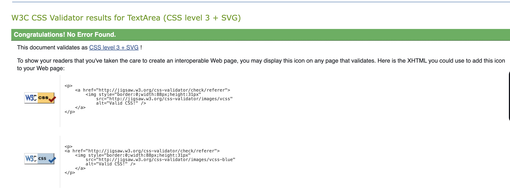

# TESTING

## Manual Testing

Every feature that was added to the site was tested before it was integrated into the main file.

The user acceptability test listed below was used to test usability. It was distributed to new users to guarantee testing from a variety of users, on a variety of devices and browsers to ensure problems were identified and, if feasible, rectified during development.


| Page    | User Actions           | Expected Results | Y/N | Comments    |
|-------------|------------------------|------------------|------|-------------|
| Sign Up     |                        |                  |      |             |
| 1           | Click on Sign Up button | Redirection to Sign Up page | Y |          |
| 2           | Click on the Login link in the form | Redirection to Login page | Y |          |
| 3           | Enter valid email 2 times | Field will only accept email address format | Y |          |
| 4           | Enter valid password 2 times | Field will only accept password format | Y |          |
| 5           | Click on Sign Up button | asks user to confirm email page Sends address a confirmation request email | Y |          |
| 6           | Confirm email | Redirects user to blank Sign In page | Y |          |
| 7           | Sign In | Redirects user to blank In page | Y |          |
| 8           | Sign In with the same email/username and password | Takes user to schedule page with pop-up confirming successful sign in. Get started button now missing in main nav, replaced by Menu | Y |          |
| 9           | Click "Logout" button  in the center of the page| Redirects user to home page | Y |          |
| 10          | Click browser back button | You are still logged out | Y |          |
| Log In      |                        |                  |      |             |
| 1           | Click on Log In button | Redirection to Log In page | Y |          |
| 2           | Click on the Sign Up link in the form | Redirection to Sign Up page | Y |          |
| 3           | Enter valid email | Field will only accept email address format | Y |          |
| 4           | Enter valid password | Field will only accept password format | Y |          |
| 5           | Click on Log In button | Redirects user to blank In page | Y |          |
| 6           | click logout button | Redirects user to home page | Y |          |
| 7           | Click browser back button | You are still logged out | Y |          |
| 8           | Click on Log In button | Redirection to Log In page | Y |          |
| 9           | Enter valid email | Field will only accept email address format | Y |          |
| 10          | Enter valid password | Field will only accept password format | Y |          |
| 11          | Click Remember Me checkbox | Remembers user | Y |          |
| 12          | Click on Log In button | Redirects user to blank In page | Y |          |
| 13          | Click logout button | Redirects user to home page | Y |          |
| 14          | Click browser back button | You are still logged out | Y |          |
| 15          | Click on Log In button | Redirection to Log In page prefilled | Y |          |
| Navigation  |                        |                  |      |             |
| 1           | Click on the logo | Redirection to home page | Y |          |
| 2           | Click Home button | Redirection to home page | Y |          |
| 3           | Click Ourmenu button | Open dropdown-menu | Y |   Dropdown menu contains 5 buttons all products,cakes,cupcakes,cookies and seasonals        |
| 4           | Click All products button | Redirection to Products page | Y | All category products can see           |
| 5           | Click Cakes button | Redirection to Products page | Y |  Only can see cakes products list        |
| 6           | Click Cupcakes button | Redirection to Products page | Y | Only can see cupcakes products list          |
| 7           | Click Cookies button | Redirection to Products page | Y |  Only can see cookies products list          |
| 8           | Click Seasonals button | Redirection to products page | Y |  Only can see seasonal products list          |
| 9           | Click About button | Redirection to About section in home page | Y |          |
| 10          | Click Gallery button |Redirection to gallery section in home page  | Y |          |
| 11          | Click Contact button | Redirection to contact us section in home page  | Y |          |
| 12          | search input and button | Shows search products | Y |          |
| 13          | Click user icon button | Open dropdown-menu | Y | Dropdown menu contains 3 buttons profile,orders and logout        |
| 14          | Click Profile button | Redirection to Profile page | Y |          |
| 15           | Click orders button | Redirection to user orders page | Y |          |
| 16           | Click logout button | Redirection to logout page | Y |          |
| 17           | Click login button | Redirection to login page | Y |  user is not loggedin login button is showing        |
| 18           | Click wishlist button | Redirection to wishlist page | Y |          |
| 19           | Click cart button | Redirection to bag page | Y |          |
| Admin Navigation |                        |                  |      |             |
| 1           | Click Product list | Redirection to product list page | Y |          |
| Home Page  |                        |                  |      |             |
| 1           | Click Order now button | Redirection to Products page | Y |          |
| Products  |                        |                  |      |             |
| 1 | click on breadcrumb buttons  | redirect to home page and product page | Y |          |
| 2  | Select a category | Products are displayed | Y |          |
| 3  | click on category list  | Products are displayed based on category  | Y |          |
| 4 | Click on sort by buttons | Products are correctly filtered  | Y |based  on name(ascending order and descending order) price(low to high hight zo low rating hight to low) works |
| 5  | Click on heart button | Product is added to wishlist and message will appear to notify user | Y | If user is logged out, the user will see a message to login and the click will be ignored |
| 6 | Click on the product card image | User will be redirected to the product details page | Y | |
| 7 | Click on page navigation | User will be redirected to the correct page | Y | |
| 8 | Click Back to top icon  | User will be redirected to top of page | Y | |
| Product Details |                        |                  |      |             |
| 1 | click on breadcrumb buttons  | navigate to corresponsing page | Y | |
| 2 | Click thumbnails | main image is changing based on click  | Y |  |
|3 | Click on the product options (size) | User will see price changes | Y | the size options only shows category cakes|
| 4 | Click on heart button | Product is added to wishlist and message will appear to notify user | Y | same time button color change to red color |
| 5| Click on the heart button agin | Product is removed from wishlist and message will appear to notify user | Y |  |
| 6 | Click on Add Reviews button | user can successfully add reviews | Y |  |
| 7 | Click on plus-minus quantity | Quantity will change | Y |  |
| 8 | Click on add to cart button | Product is added to cart and message will appear to notify user | Y | If user is logged out, the user will see a message to login and the click will be ignored |
| 9 | Click on related product view details button | redirect to corresponding product detail page | Y |  |
| 10 | we can write comment and star rating in the review section | added reviews in product detail page | Y |  |
| Wishlist |                        |                  |      |             |
| 1 | Click on empty wishlist button | User will see go to product menu button | Y | If user is logged out, the user will see a message to login and the click will be ignored |
| Profile |                        |                  |      |             |
| 1 | Click on the profile button | User will be redirected to the edit profile page | Y | |
| 2 | Click on the  address button | User will be redirected to the address page | Y | |
| 3 | Click on the update addresses button | User will be redirected to the manage addresses page | Y |  |
| 4 | Click on the account settings button | User will be redirected to the setting page | Y | user can rest email and password |
| 5 | Click on the account delete button | User will be redirected to the account delete page | Y | user can delete account |
| Cart |                        |                  |      |             |
| 1 | Click on quantity button | quantity number increase and decrease | Y | |
| 2 | Click on the update icon | User can see updated total price based on quantity| Y | |
| 3 | Click on the trash icon |carted product delete | Y |  |
| 4 | delivery option drop down | user can select online delivery and pickup | Y | Based on delivery option delivery cost is change |
| 5 | Click on checkout button | user will be redirect to payment page | Y | |
| Checkout |                        |                  |      |             |
| 1 | Type in the Full name | Full name is changed | Y | If user has filled out the profile name and email id comes automatically |
| 2 | Type in the email | Email is changed | Y | |
| 3 | Type in the phone number | Phone number is changed | Y | If user has set the primary address, the phone number will be set automatically |
| 4 | Type in the address | Address is changed | Y | If user has set the primary address, the address will be set automatically |
| 5 | Type in the zip code | Zip code is changed | Y | If user has set the primary address, the zip code will be set automatically |
| 6 | Select country | Country is selected | Y | If user has set the primary address, the country will be set automatically |
| 7 | Select state | State is selected | Y | If user has set the primary address, the state will be set automatically |
| 8 | Select city | City is selected | Y | If user has set the primary address, the city will be set automatically |
| 9 | Type payment card data | Payment card data is changed | Y | |
| 10 | Click on the pay button | The pay button will be disabled and the user will see a message to notify them | Y | If the payment card is not valid, the user will see a message to notify them. If the payment was successful, the user will be redirected to the order placed page and user will also receive an email notification |
| Order Placed |


## Automated testing

### Django unit testing
I made the decision to use Django's integrated unit testing framework.To test the code, I have the following 
testing commands open in my terminal:


#### Products App
```python
from django.test import TestCase
from django.utils import timezone
from .models import Category, Tag, Discount, Product, ProductImage

class CategoryModelTest(TestCase):
    def setUp(self):
        self.category = Category.objects.create(name='Test Category', is_active=True)

    def test_category_creation(self):
        category = Category.objects.create(name='Test Category', is_active=True)
        self.assertEqual(category.name, 'Test Category')
        self.assertTrue(category.is_active)
        self.assertIsNotNone(category.slug)

class TagModelTest(TestCase):
    def setUp(self):
        self.tag = Tag.objects.create(name='Test Tag', is_active=True)

    def test_tag_creation(self):
        tag = Tag.objects.create(name='Test Tag', is_active=True)
        self.assertEqual(tag.name, 'Test Tag')
        self.assertTrue(tag.is_active)
        self.assertIsNotNone(tag.slug)

class DiscountModelTest(TestCase):
    def setUp(self):
        self.discount = Discount.objects.create(
            percentage=10,
            start_date=timezone.now().date(),
            end_date=timezone.now().date() + timezone.timedelta(days=1),
            is_active=True
        )
        def test_discount_validity(self):
            self.assertTrue(self.discount.is_valid())

        def test_discount_invalidity(self):
            invalid_discount = Discount.objects.create(
                percentage=10,
                start_date=timezone.now().date() + timezone.timedelta(days=2),
                end_date=timezone.now().date() + timezone.timedelta(days=3),
                is_active=True
            )
            self.assertFalse(invalid_discount.is_valid())
class ProductModelTest(TestCase):
    def setUp(self):
        self.category = Category.objects.create(name='Test Category', is_active=True)
        self.tag = Tag.objects.create(name='Test Tag', is_active=True)
        self.discount = Discount.objects.create(percentage=10, start_date=timezone.now().date(), end_date=timezone.now().date() + timezone.timedelta(days=1), is_active=True)

    def test_product_creation(self):
        product = Product.objects.create(name='Test Product', description='Test Description', category=self.category, price=50.0, discount_price=self.discount, availability='in_stock')
        product.tags.add(self.tag)

        self.assertEqual(product.name, 'Test Product')
        self.assertEqual(product.description, 'Test Description')
        self.assertEqual(product.category, self.category)
        self.assertEqual(product.price, 45.0)  # Discounted price
        self.assertTrue(product.is_active)
        self.assertIsNotNone(product.slug)
        self.assertTrue(product.discount_price.is_valid())
        self.assertEqual(product.availability, 'in_stock')

class ProductImageModelTest(TestCase):
    def setUp(self):
        self.category = Category.objects.create(name='Test Category', is_active=True)
        self.product = Product.objects.create(name='Test Product', description='Test Description', category=self.category, price=50.0, availability='in_stock')
        self.product_image = ProductImage.objects.create(product=self.product, alt_text='Test Alt Text', default_image=True, is_active=True)

    def test_product_image_creation(self):
        self.assertEqual(self.product_image.product, self.product)
        self.assertEqual(self.product_image.alt_text, 'Test Alt Text')
        self.assertTrue(self.product_image.default_image)
        self.assertTrue(self.product_image.is_active)
        self.assertIsNotNone(self.product_image.image_url)

```
#### Review App

```python
  from django.test import TestCase
from django.contrib.auth.models import User
from products.models import Product
from orders.models import Order
from .models import Review

class ReviewModelTest(TestCase):
    def setUp(self):
        # Create a user, product, and order for testing
        self.user = User.objects.create(username='testuser')
        self.product = Product.objects.create(name='Test Product', price=10.0)
        self.order = Order.objects.create(user=self.user, total_paid=10.0)

    def test_review_creation(self):
        # Create a review and check if it's saved successfully
        review = Review.objects.create(
            user=self.user,
            product=self.product,
            order=self.order,
            rating=5,
            comment='Great product!',
        )

        self.assertEqual(review.user, self.user)
        self.assertEqual(review.product, self.product)
        self.assertEqual(review.order, self.order)
        self.assertEqual(review.rating, 5)
        self.assertEqual(review.comment, 'Great product!')

    def test_review_str_method(self):
        # Test the __str__ method of the Review model
        review = Review.objects.create(
            user=self.user,
            product=self.product,
            order=self.order,
            rating=4,
            comment='Nice product!',
        )

        expected_str = f'{self.user.username} - {self.product.name} - 4'
        self.assertEqual(str(review), expected_str)

    def test_review_ordering(self):
        # Test the ordering of reviews by created_at
        review1 = Review.objects.create(user=self.user, product=self.product, rating=3)
        review2 = Review.objects.create(user=self.user, product=self.product, rating=4)

        reviews = Review.objects.all()
        self.assertEqual(reviews[0], review2)
        self.assertEqual(reviews[1], review1)

```
#### Profile App
```python
 from django.test import TestCase
from django.contrib.auth.models import User
from .models import Profile
from django_countries.fields import Country
from datetime import date

class ProfileModelTest(TestCase):
    def setUp(self):
        # Create a user for testing
        self.user = User.objects.create(username='testuser')

    def test_profile_creation(self):
        # Create a profile and check if it's saved successfully
        profile = Profile.objects.create(
            user=self.user,
            first_name='John',
            last_name='Doe',
            birthday=date(1990, 1, 1),
            phone_number='123456789',
            country=Country('US'),
            postcode='12345',
            town_or_city='Test City',
            street_address1='123 Test St',
            street_address2='Apt 4',
            county='Test County',
        )

        self.assertEqual(profile.user, self.user)
        self.assertEqual(profile.first_name, 'John')
        self.assertEqual(profile.last_name, 'Doe')
        self.assertEqual(profile.birthday, date(1990, 1, 1))
        self.assertEqual(profile.phone_number, '123456789')
        self.assertEqual(profile.country, Country('US'))
        self.assertEqual(profile.postcode, '12345')
        self.assertEqual(profile.town_or_city, 'Test City')
        self.assertEqual(profile.street_address1, '123 Test St')
        self.assertEqual(profile.street_address2, 'Apt 4')
        self.assertEqual(profile.county, 'Test County')

    def test_profile_str_method(self):
        # Test the __str__ method of the Profile model
        profile = Profile.objects.create(user=self.user, first_name='John', last_name='Doe')

        self.assertEqual(str(profile), 'John Doe')

    def test_profile_age_property(self):
        # Test the age property of the Profile model
        profile = Profile.objects.create(user=self.user, birthday=date(1990, 1, 1))

        self.assertEqual(profile.age, 33)  # Assuming the current year is 2023

    def test_profile_age_property_invalid_birthday(self):
        # Test the age property with an invalid birthday
        profile = Profile.objects.create(user=self.user, birthday=date(2090, 1, 1))

        self.assertEqual(profile.age, 'Invalid birthday')

    def test_profile_age_property_no_birthday(self):
        # Test the age property with no birthday
        profile = Profile.objects.create(user=self.user)

        self.assertIsNone(profile.age)

```

#### Order App
```python
from django.test import TestCase
from django.contrib.auth.models import User
from products.models import Product
from .models import Order, OrderItem
from decimal import Decimal
from django.utils import timezone

class OrderModelTest(TestCase):
    def setUp(self):
        self.user = User.objects.create_user(username='testuser', password='testpassword')
        self.product = Product.objects.create(name='Test Product', description='Test Description', category=your_category_instance, price=50.0, availability='in_stock')
        self.order = Order.objects.create(
            user=self.user,
            full_name='John Doe',
            email='john@example.com',
            phone='123456789',
            address1='Test Address 1',
            city='Test City',
            county_region_state='Test County',
            country='Test Country',
            zip_code='12345',
            total_paid=50.0,
            order_key='test_order_key',
            billing_status=False,
            status=Order.PENDING,
            order_total=50.0,
            delivery_cost=0.0,
            grand_total=50.0
        )
        self.order_item = OrderItem.objects.create(order=self.order, product=self.product, quantity=2, size='M')

    def test_order_creation(self):
        self.assertEqual(str(self.order), f"Order ID: {self.order.order_id}, Order Number: {self.order.order_key}, Order Total: ${self.order.order_total}")
        self.assertEqual(self.order.get_order_items().count(), 1)
        self.assertEqual(self.order.total_paid, 50.0)

    def test_update_total(self):
        self.order_item.quantity = 3
        self.order_item.save()
        self.order.update_total()
        self.assertEqual(self.order.order_total, 150.0)
        self.assertEqual(self.order.delivery_cost, 0.0)
        self.assertEqual(self.order.grand_total, 150.0)

class OrderItemModelTest(TestCase):
    def setUp(self):
        self.user = User.objects.create_user(username='testuser', password='testpassword')
        self.product = Product.objects.create(name='Test Product', description='Test Description', category=your_category_instance, price=50.0, availability='in_stock')
        self.order = Order.objects.create(
            user=self.user,
            full_name='Jibin johny',
            email='jibin@example.com',
            phone='123456789',
            address1='Test Address 1',
            city='Test City',
            county_region_state='Test County',
            country='Test Country',
            zip_code='12345',
            total_paid=50.0,
            order_key='test_order_key',
            billing_status=False,
            status=Order.PENDING,
            order_total=50.0,g
            delivery_cost=0.0,
            grand_total=50.0
        )
        self.order_item = OrderItem.objects.create(order=self.order, product=self.product, quantity=2, size='M')

    def test_order_item_creation(self):
        self.assertEqual(str(self.order_item), "2 x Test Product (M)")
        self.assertEqual(self.order_item.get_total(), 100.0)


```
**bugs:**

1. Navbar dropdown menu not working all pages 
2. product page card if click wishlist button it will redirect to product detail page.but product is correctly add to wishlist page.
3. Sometimes, an AJAX request error occurs during the payment process. However, upon refreshing the page and attempting the payment again, the process works seamlessly.

### CSS Validation:

- 
- The official [W3C (Jigsaw)](https://jigsaw.w3.org/css-validator/#validate_by_uri) validator yielded no errors or warnings, with the exception of a note on the usage of webkits.But CSS code functions flawlessly across a range of platforms.

### JS Validation:

- [Full JS Validation Report](documentation/jsvalidation.pdf)
No errors or are found when passing through the official [JSHint](https://www.jshint.com/) validator.